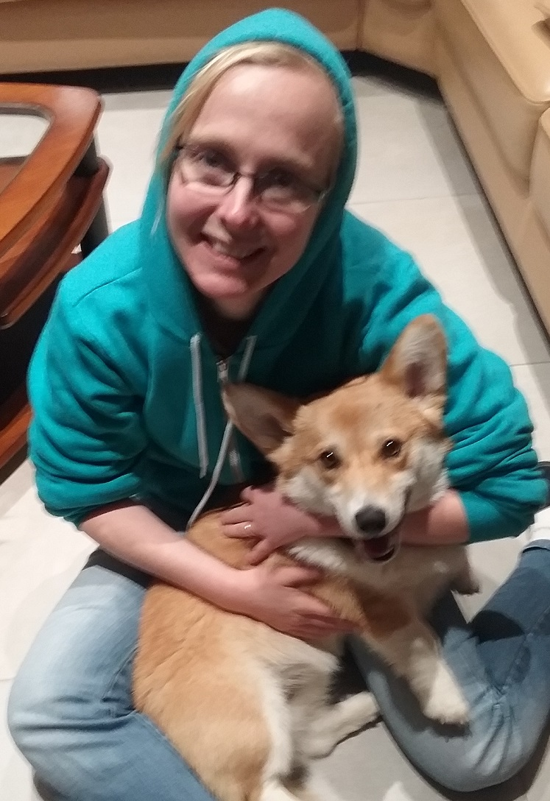

# Introduction

## Who am I? (1/2)

* Data manager/statistician for CHAI project at ISGlobal.

* PhD in statistics.

* R user, developper, addict.

* R-Ladies BCN co-organizer.

* Co-editor at rOpenSci onboarding (more on that later!)

## Who am I? (2/2): Mowgli's sister!

```{r echo = FALSE, out.width = "400px"}

```
